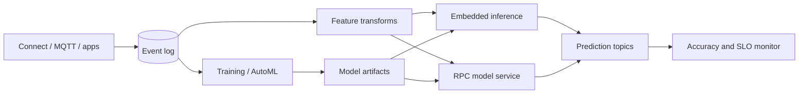

# Inferflux

**Source:** `ai-in-enterprise/Using Apache Kafka to Drive Cutting-Edge Machine Learning _ Confluent/`
**Domain:** `ai-enterprise`
**One-liner:** A streaming feature and event ML runtime that prepares features on the event bus, deploys models either embedded in stream processors or via governed RPC, and monitors accuracy continuously—so real-time predictions inherit Kafka-grade scale without cloud lock-in.
**Wedge:** Enterprises that already run Kafka (or Confluent) for mission-critical events and need millisecond-to-second ML inference on those streams—fraud, IoT anomaly, connected-product, personalization—without standing up a separate brittle serving island.
**Positioning:** Streaming ML runtime. Batch training lakes and standalone model servers ignore embed-vs-RPC tradeoffs, hybrid training/inference locality, KSQL/stream preprocessing, and AutoML model export into event paths. Inferflux makes those first-class.

## Market research synthesis

### Thesis from source

Kai Waehner’s Confluent essay argues that machine learning and the Apache Kafka ecosystem are a natural pair for training and deploying analytic models at scale because Kafka already acts as the **scalable, reliable central nervous system** for enterprise data. The ML lifecycle splits into training on historical data and generating predictions on new events, continuously improved and redeployed. Predictions inside event-driven apps have two primary patterns: **embed** the model in Kafka Streams/KSQL (e.g., TensorFlow Java, H2O, DL4J) or call a **dedicated model server** (TensorFlow Serving) over HTTP/gRPC.

The tradeoffs are product requirements. Model servers win on familiar ops, built-in model management/A-B, and easier non-streaming migration paths. They lose on latency, cloud/tech lock-in, complex security across firewalls, no offline/edge inference, coupling stream SLAs to RPC SLAs, and side effects outside Kafka’s exactly-once processing. Embedding wins on latency, locality (including PII at the edge), and transactional integrity with the stream—but needs disciplined model packaging inside stream apps.

Hybrid architectures are normal: train elastically in public cloud (including specialized accelerators) or on-prem DGX-class gear; infer in cloud, datacenter, or edge with poor connectivity. Kafka (Connect, Streams, KSQL, MirrorMaker/Replicator) stitches multi-cloud and hybrid without proprietary cloud ML APIs. Real-time requirements span retraining with current data, predictions in **milliseconds or seconds**, monitoring of accuracy and infra errors, and security provenance. KSQL lowers the barrier for filtering, joins, feature engineering, and—via UDFs—model application (MQTT car-sensor anomaly autoencoder example: `ANOMALY(sensor_input)`). AutoML (DataRobot, Google AutoML, H2O) can generate models that export for embedding into Streams/KSQL rather than only REST scoring. The “Hidden Technical Debt in Machine Learning Systems” framing plus tech-giant platforms (Uber Michelangelo, Netflix Meson) show why a flexible, multi-framework, Kafka-centered runtime beats a single-framework stack.

Inferflux productizes the **governance of streaming ML paths**: feature prep jobs, deployment mode selection (embed vs RPC), hybrid topology, model artifacts on the bus, and continuous accuracy/SLA monitoring.

### Buyer & economic model

- **Primary buyer:** Head of Streaming Platform, Chief Architect for Event-Driven Systems, or VP of Real-Time Analytics / ML Platform in a Kafka-centric enterprise.
- **Users:** stream engineers, ML engineers, data scientists (feature definitions), SREs (SLA), security (PII locality), product owners of real-time use cases.
- **Budget owner / value metric:** streaming platform + inference budget. Value metric is p99 prediction latency, % predictions completed inside Kafka transactional boundaries, accuracy drift MTTD, and avoidance of dual-pipeline (batch + ad-hoc RPC) cost.
- **Competing status quo:** micro-batch features in a warehouse, synchronous calls from services to a cloud AutoML endpoint, and separate monitoring that never sees the event log as source of truth.

### Domain constraints

- **Regulatory / trust / safety:** PII may require on-prem/edge inference; audit of who deployed which model to which stream path; exactly-once expectations for financial/IoT actuators.
- **Data sensitivity:** features on topics; replication across clouds; MQTT/IoT device data.
- **Change-management realities:** many ML teams default to model servers; embed path needs packaged artifacts and UDF governance. Hybrid ops require clear training vs inference locality policies.

## Business requirements

- BR-1: Every streaming ML use case must declare inference mode—embedded in stream processing or RPC to a model service—with an explicit tradeoff record (latency, lock-in, edge offline, exactly-once).
- BR-2: Feature preparation for training and inference must be expressible as governed stream transforms (filter, join, enrich) versioned alongside the model.
- BR-3: Models consumed on streams must be versioned artifacts addressable by embed packages or RPC endpoints, with rollback to a prior stream revision.
- BR-4: Hybrid topologies must record where training runs vs where inference runs (cloud, on-prem, edge) and whether topics replicate across those environments.
- BR-5: Prediction latency SLOs (ms/s) and accuracy monitoring must be defined before production traffic is enabled.
- BR-6: Embedded deployments must support offline/edge inference scenarios where connectivity is limited, when the use case requires it.
- BR-7: RPC deployments must document failure behavior and whether side effects are outside the stream processor’s transactional guarantees.
- BR-8: AutoML-origin models must be importable as exportable artifacts for embed paths, not only as remote REST scorers.
- BR-9: Multi-framework models (TensorFlow, H2O, others) must be first-class; the runtime cannot hard-lock to one ML library.
- BR-10: Security controls must cover topic ACLs, PII locality constraints, and deployment provenance for model binaries/UDFs.
- BR-11: Operators must be able to A/B or shadow models on the same feature stream and compare accuracy without dual ingestion pipelines.
- BR-12: Reprocessing from the commit log must be supported for training refresh and for backfill scoring when models change.

## User stories

Canonical user stories live in sibling [USER_STORIES.md](USER_STORIES.md).

## System design

### Overview

Inferflux sits on the enterprise event backbone. Operators define feature streams, bind model deployments (embed package or RPC), set locality and SLO policies, and monitor accuracy and latency. Training systems consume historical topic data or lakes fed by Kafka Connect; inference writes predictions and monitoring events back to topics. The product API governs configuration and lifecycle; Kafka remains the runtime fabric.

### Actors & boundaries

- **Actors:** stream engineers, ML engineers, data scientists, SREs, security, use-case product owners.
- **Trust boundary:** Inferflux control plane configures deployments and reads metrics; message payloads remain on Kafka clusters under existing ACLs. Model binaries stored in artifact registries.
- **Human-in-the-loop points:** approving embed of untrusted UDFs; crossing PII locality boundaries; production cutover from shadow to live; exception to exactly-once limitations on RPC paths.

### Core capabilities

1. **Feature stream definitions** — versioned prep for train and serve.
2. **Deployment mode governance** — embed vs RPC with tradeoff records.
3. **Model artifact registry** — multi-framework, AutoML import, rollback.
4. **Hybrid topology manager** — train/infer locality and replication links.
5. **Shadow & A/B routing** — challenger evaluation on live features.
6. **SLO & accuracy monitoring** — latency, errors, drift, provenance.
7. **Edge/offline packages** — embed bundles for constrained devices/sites.
8. **Security & ACL policy** — PII locality, topic access, deploy provenance.
9. **Reprocess & backfill jobs** — commit-log replay for training/scoring.

### Conceptual data

- **Primary entities:** FeatureStream, TransformVersion, ModelArtifact, Deployment, DeploymentMode, HybridLink, ShadowExperiment, LatencySLO, AccuracyMetric, ProvenanceRecord, LocalityPolicy.
- **Critical events:** transform published, model registered, deployment started/shadow/live, SLO breached, drift detected, rollback executed, reprocess completed.
- **Retention / audit needs:** deployment and provenance retained for decision audit windows; raw features retained per topic retention; PII minimization in control-plane logs.

### Integrations (conceptual)

- **Systems of record:** Kafka clusters, Schema Registry, model artifact stores, AutoML exporters, observability (latency/accuracy), IAM/ACLs.
- **Upstream signals:** topic data, training job completions, device/MQTT connectors, replicator lag.
- **Downstream actions:** prediction topics, alert actuators (maintenance/fraud), retraining triggers, incident tickets on SLO breach.

### High-level architecture

### Success metrics

- **Leading:** % use cases with completed mode-tradeoff records; share of inferences embedded vs RPC; feature train/serve skew incidents; shadow experiments before cutover.
- **Lagging:** p99 prediction latency; accuracy drift MTTD/MTTR; SLO burn from ML paths; reduction in dual ingestion pipelines; successful hybrid failovers.

## OpenAPI skeleton

Canonical HTTP surface lives in sibling [openapi.yaml](openapi.yaml). Summary:

- **Base path:** `/v1/...`
- **Auth:** `X-API-Key` for automation; Bearer JWT for operators.
- **Resource groups:** FeatureStreams, Models, Deployments, Experiments, Monitoring, Topologies.
