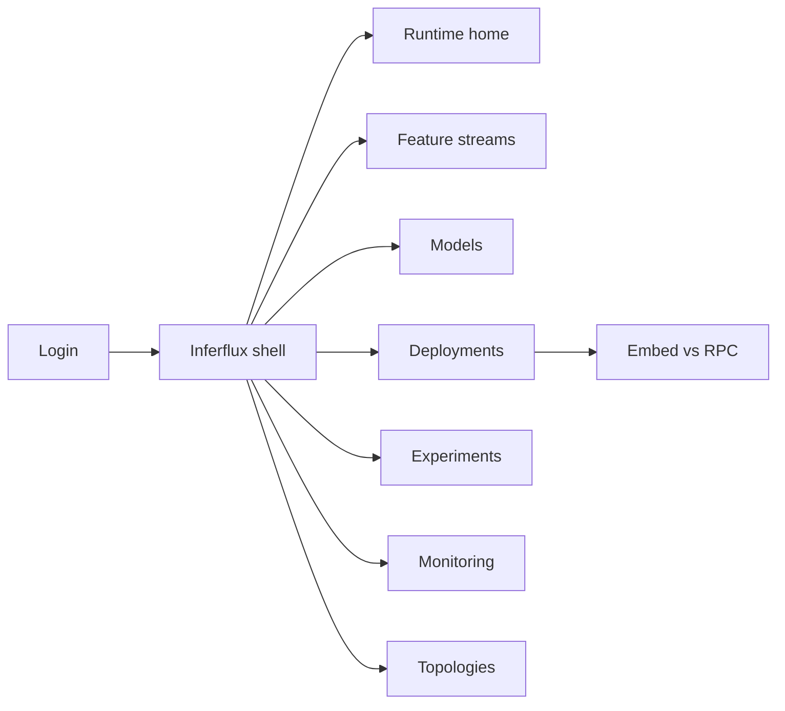
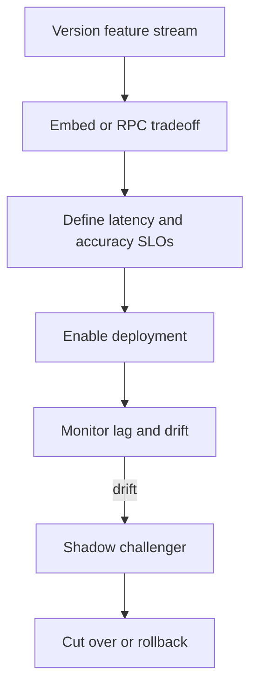

# Inferflux — Web app

**Product:** [PRODUCT.md](./PRODUCT.md)
**Primary surface:** Streaming ML runtime control plane (Kafka / event-platform console)
**Secondary surfaces:** SRE SLO burn view; security locality attestation export
**Design thesis:** Inferflux is a switchboard on the enterprise event nervous system — not a batch AutoML portal. The UI metaphor is embed-vs-RPC as two powered rails on the same Kafka spine: feature prep, model artifacts, and predictions stay on topics, while every deployment forces an explicit tradeoff card (latency, lock-in, edge offline, exactly-once). Visual language is Kafka-black with stream-cyan flow lines and caution-amber when RPC side effects leave transactional boundaries. Hybrid topology maps show where training lives vs where inference runs — cloud, on-prem, edge — so PII locality is a place on a map, not a footnote.

## UX research synthesis

### Category peers (best-in-class)

- **Confluent Control Center / Cloud UI:** Topic lineage, throughput, consumer lag. Steal: stream-first navigation and lag adjacent to ML SLO; reject burying ML as a generic “connector.”
- **Kafka Streams / ksqlDB flow UIs:** Visual prep (filter/join) versioning. Steal: feature transforms versioned beside models; reject SQL-only without deployment mode governance.
- **TF Serving / Seldon + feature stores (Feast streaming):** RPC serving and point-in-time features. Steal: clear RPC failure behavior docs; reject defaulting every use case to remote score and ignoring embed.
- **Uber Michelangelo / Netflix Meson narratives (ops consoles):** Multi-framework, continuous monitoring. Steal: shadow/A-B on same feature stream; reject single-framework lock-in UX.

### Patterns to adopt / reject

- **Adopt:** Mandatory embed-vs-RPC tradeoff record; versioned feature streams; hybrid training/inference locality; latency + accuracy SLOs before prod traffic; AutoML export for embed; multi-framework artifacts; shadow experiments; reprocess from commit log; PII locality controls.
- **Reject:** Cloud AutoML REST as only path; dual ingestion for A/B; hiding exactly-once limitations on RPC; purple “real-time AI”; batch warehouse as home.

### Trust, density, and workflow constraints from PRODUCT.md

Payloads stay on Kafka under existing ACLs (trust boundary). PII may force on-prem/edge inference (BR-6, BR-10). RPC side effects outside exactly-once must be documented (BR-7). Prod traffic requires SLO definitions (BR-5). Untrusted UDF embed needs human approval.

## Information architecture

### Nav model

### Roles → default home

| Role | Default home | Why |
|------|--------------|-----|
| Stream / platform engineer | Feature streams / Topologies | Shared prep + hybrid map (BR-2, BR-4) |
| ML engineer | Deployments | Mode choice + rollback (BR-1, BR-3) |
| Data scientist / AutoML | Models — import export | Embed-capable artifacts (BR-8) |
| SRE | Monitoring | p99 and error budgets (BR-5) |
| Security | Topologies — locality | PII constraints (BR-10) |
| Product owner (fraud/IoT) | Runtime home — use-case health | Actionable prediction topics |

### Cross-links to OpenAPI resources

| Nav area | OpenAPI tags / resources |
|----------|---------------------------|
| Feature streams | FeatureStreams |
| Model artifacts | Models |
| Deployments / mode | Deployments |
| Shadow / A-B | Experiments |
| Latency / accuracy | Monitoring |
| Hybrid maps | Topologies |

## Screen inventory

### Runtime home

- **Purpose:** One composition: live streaming ML paths, SLO burn, embed vs RPC mix, locality alerts.
- **Entry:** Default for platform lead.
- **Layout regions:** Brand + cluster context; path health table; p99 strip; accuracy drift MTTD; amber RPC transactional warnings; alerts.
- **Primary actions:** Open deployment; freeze prod traffic; open topology.
- **Empty / loading / error:** Empty = register first feature stream; loading = skeleton; error = retry with request id.
- **BR / story ties:** BR-5; SRE stories.

### Feature stream definitions

- **Purpose:** Versioned prep (filter, join, enrich) shared by train and serve.
- **Entry:** Nav → Feature streams.
- **Layout regions:** Transform list/SQL; version history; train extract vs live bind; skew warnings.
- **Primary actions:** Create version; validate; bind to deployment.
- **Empty / loading / error:** Invalid SQL = inline error; no version = cannot deploy.
- **BR / story ties:** BR-2.

### Model artifacts

- **Purpose:** Multi-framework artifacts addressable for embed packages or RPC endpoints; AutoML import.
- **Entry:** Nav → Models.
- **Layout regions:** Artifact table (TF, H2O, etc.); embed-ready vs RPC-only badges; AutoML import wizard; rollback targets.
- **Primary actions:** Import AutoML export; register embed package; register RPC endpoint ref.
- **Empty / loading / error:** REST-only AutoML without export = block embed path with guidance.
- **BR / story ties:** BR-3, BR-8, BR-9.

### Deployment mode workspace

- **Purpose:** Force embed vs RPC with tradeoff record before enable.
- **Entry:** Nav → Deployments; create deployment.
- **Layout regions:** Mode toggle; tradeoff checklist (latency, lock-in, edge offline, exactly-once); failure behavior (RPC); artifact bind; feature stream version; enable prod gate.
- **Primary actions:** Save tradeoff; deploy; rollback stream revision.
- **Empty / loading / error:** Incomplete tradeoff = cannot enable prod (BR-1).
- **BR / story ties:** BR-1, BR-7.

### Edge / offline embed

- **Purpose:** Support limited-connectivity inference when required.
- **Entry:** Deployment when edge flagged.
- **Layout regions:** Package size; sync policy; offline capability status; PII locality.
- **Primary actions:** Approve edge package; schedule sync.
- **Empty / loading / error:** Connectivity-required RPC selected for offline use case = block.
- **BR / story ties:** BR-6.

### Hybrid topology map

- **Purpose:** Record training vs inference localities and topic replication.
- **Entry:** Nav → Topologies.
- **Layout regions:** Map/list of cloud/on-prem/edge; MirrorMaker/replicator status; PII policy overlays.
- **Primary actions:** Update locality; request replication; attest policy.
- **Empty / loading / error:** Inference locality undeclared = deploy warning.
- **BR / story ties:** BR-4, BR-10.

### Experiments (shadow / A-B)

- **Purpose:** Compare models on the same feature stream without dual ingestion.
- **Entry:** Nav → Experiments.
- **Layout regions:** Control vs challenger; traffic split/shadow; accuracy delta; cutover CTA.
- **Primary actions:** Start shadow; promote; abort.
- **Empty / loading / error:** Missing shared feature version = block.
- **BR / story ties:** BR-11.

### Monitoring

- **Purpose:** Prediction latency SLOs and continuous accuracy + infra errors.
- **Entry:** Nav → Monitoring; home drills.
- **Layout regions:** p99/p50; error budget; accuracy drift; topic lag correlation; provenance deep links.
- **Primary actions:** Adjust SLO; page on burn; open reprocess.
- **Empty / loading / error:** No SLO defined = prod enable blocked (BR-5).
- **BR / story ties:** BR-5.

### Reprocess / backfill

- **Purpose:** Reprocess from commit log for training refresh or backfill scoring.
- **Entry:** Monitoring or model change CTA.
- **Layout regions:** Offset/time window; target model version; write-back topic; progress.
- **Primary actions:** Start reprocess; cancel; audit run.
- **Empty / loading / error:** ACL denial surfaced clearly.
- **BR / story ties:** BR-12.

### Security provenance

- **Purpose:** Topic ACLs, PII locality, deployment provenance for binaries/UDFs.
- **Entry:** Security role; topology + deployment.
- **Layout regions:** Provenance log; UDF approval queue; locality violations.
- **Primary actions:** Approve UDF; revoke; export attestation.
- **Empty / loading / error:** Unapproved UDF embed = blocked.
- **BR / story ties:** BR-10.

## Key flows

1. **Governed streaming deploy** — define feature stream → choose embed/RPC with tradeoffs → set SLOs → deploy → monitor; failure: missing tradeoff or SLO.

2. **AutoML to embed** — import exportable artifact → package for Streams/UDF → deny REST-only path (BR-8).

3. **Hybrid locality** — declare train vs infer places → replication → PII check (BR-4, BR-10).

4. **Shadow accuracy** — same feature stream → compare → promote (BR-11).

5. **Commit-log reprocess** — select window → score with new model → backfill topic (BR-12).

## Design system

### Tokens (CSS variables)

- `--color-ink: #E6F2F5` — text on dark
- `--color-kafka-black: #0B0E11` — app ground
- `--color-panel: #141A1F` — panels
- `--color-rule: #2A343C` — dividers
- `--color-cyan: #00C2D4` — stream flow / healthy path
- `--color-amber: #E0A83A` — RPC transactional caveat
- `--color-coral: #E85D4C` — SLO burn / locality violation
- `--color-mint: #3DDC97` — shadow success / promote ready
- `--color-brand: #00C2D4` — Inferflux mark
- `--font-display: "Chakra Petch", sans-serif` — runtime titles (technical, not Inter)
- `--font-body: "IBM Plex Sans", sans-serif` — forms
- `--font-mono: "IBM Plex Mono", monospace` — topics, offsets, model hashes
- `--space-1`…`--space-8`: 4px scale
- `--radius-sm: 2px`; `--radius-md: 6px`
- `--motion-flow: 280ms linear` — cyan stream pulse
- `--motion-mode: 200ms ease-out` — embed/RPC switch
- `--motion-burn: 240ms ease-in-out` — SLO burn warning
- Atmosphere: faint topic-partition stripes; cyan particle flow on home; no fluffy cloud AI art.

### Typography & brand

- Chakra Petch for path names; Plex for dense ops; mono for topics/offsets.
- Brand in shell on every deployment view; login: brand + “ML on the event spine — embed or RPC, chosen deliberately” + one CTA.

### Do / don’t

- **Do:** Force tradeoff cards; version features with models; map hybrid locality; shadow on one stream; document RPC exactly-once gaps.
- **Don’t:** Default cloud REST scoring; dual pipelines for A/B; purple real-time AI; hide lag from ML views.

### Accessibility & domain trust cues

- Mode and SLO states labeled in text.
- Live regions for burn rate and locality violations.
- Focus order: features → mode tradeoff → SLO → deploy → monitor.

## Component patterns

- **EmbedRpcTradeoffCard** — mandatory checklist before enable.
- **FeatureStreamVersion** — prep logic with train/serve bind.
- **HybridLocalityMap** — train vs infer places + replication.
- **PredictionSloBurn** — p99 and error budget.
- **ShadowExperimentRail** — control vs challenger on one stream.
- **AutoMlEmbedImport** — exportable artifact gate.
- **RpcSideEffectBanner** — exactly-once caveat.
- **CommitLogReprocess** — windowed backfill.
- **UdfProvenanceQueue** — approval for embed binaries.

## Out of scope for v1 web

- Replacing Confluent/Kafka admin in full; training notebook IDE; generic iPaaS; native mobile SRE apps; public multi-tenant streaming cloud; non-Kafka bus as primary fabric in v1.
